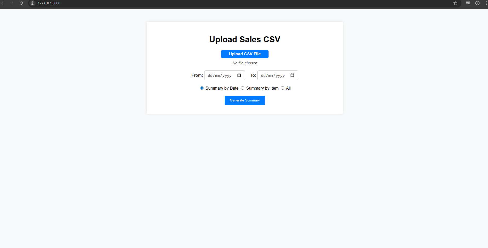

🔹 Upload your sales CSV  
🔹 See visual + tabular summaries instantly  
🔹 Export charts & tables to PDF or Excel  

# 📊 Sales Summary Web App

A lightweight, modern **Flask-based web application** for quickly generating visual and tabular sales summaries from CSV files. Choose summaries by **Date**, **Item**, or both. Ideal for freelancers, small businesses, or internal analytics tools.

---

## 🚀 Features

### 📥 Upload & Process
- Upload `.csv` files with `date`, `item`, and `amount` columns  
- Auto-validates structure and handles formatting errors
- Sample CSV included (`sample_sales.csv`) ✅

### 📊 Summary Options
- View summaries:
  - 🗓 **By Date**
  - 📦 **By Item**
  - 🔁 **Date + Item** (Combined)
- Total sales row included 💰

### 📈 Chart Dashboard
- Interactive charts via Chart.js
- Choose from: **Bar**, **Line**, or **Pie**
- Filter by date range

### 📤 Export & Reset
- 📥 Export results to **Excel (.xlsx)**
- 🖨 Export **Chart + Table to PDF**
- 🔄 Clear/reset uploaded data

### 🧠 User Experience
- Onboarding overlay for first-time users
- Error messages with clear file-format guidance
- Logout button (for multi-user setups)

---

## 🖼 Preview

  
_Sample view of the dashboard with summary table and chart_

---

## 📁 Folder Structure

project/
│
├── app.py
├── requirements.txt
├── sample_sales.csv
│
├── templates/
│   ├── index.html          # Upload and summary page
│   ├── dashboard.html      # Chart view
│   └── dashboard_pdf.html  # For PDF export
│
└── static/
    ├── style.css
    ├── script.js
    └── screenshot.png      # Used in README preview

---

## 📦 Requirements

Install all dependencies using:

pip install -r requirements.txt

▶️ How to Run Locally

python app.py

Then open your browser and go to:

http://127.0.0.1:5000

---

### 📄 CSV Format
Ensure your CSV is structured like this:

- **Date:** must be in `DD/MM/YYYY` format  
- **Amounts:** only numbers (no symbols or commas)  
- No empty rows or extra headers  
- Date: in DD/MM/YYYY format

---

### 📦 What’s Included in the Download

- Full Flask project source code
- Sample CSV file for testing
- HTML templates (upload, dashboard, PDF)
- Static assets (CSS, JS, screenshot)
- README with setup instructions
- MIT License

---

🔒 Disclaimer
This is a demo/prototype tool.
Do not upload sensitive or confidential data.

📝 License
This project is licensed under the MIT License — see the LICENSE file for details.

⚠️ Disclaimer
This is a demo tool. Use at your own risk.
Do not upload confidential, private, or sensitive information.

🌐 Live Demo (optional)
🔗[ Click here to try the live demo](http://127.0.0.1:5000)
