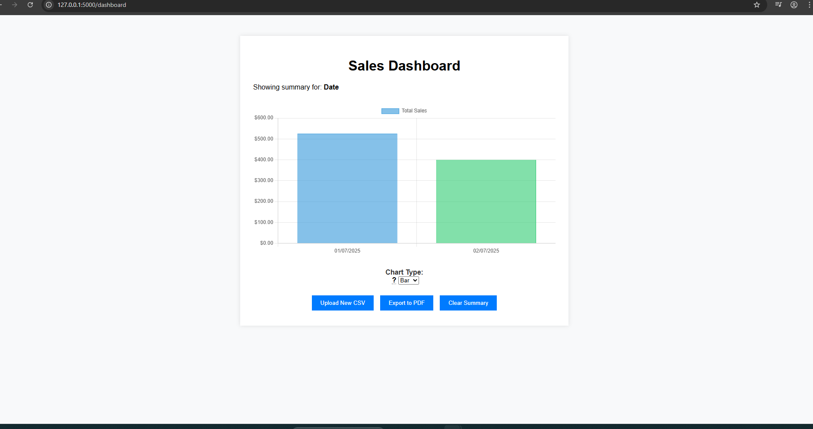

🔹 Upload your sales CSV  
🔹 See visual + tabular summaries instantly  
🔹 Export charts & tables to PDF or Excel  

# 📊 Sales Summary Web App

A lightweight, modern **Flask-based web application** for quickly generating visual and tabular sales summaries from CSV files. Choose summaries by **Date**, **Item**, or both. Ideal for freelancers, small businesses, or internal analytics tools.

---

## 🚀 Features

### 📥 Upload & Process
- Upload `.csv` files with `date`, `item`, and `amount` columns  
- Auto-validates structure and handles formatting errors
- Sample CSV included (`sample_sales.csv`) ✅

### 📊 Summary Options
- View summaries:
  - 🗓 **By Date**
  - 📦 **By Item**
  - 🔁 **Date + Item** (Combined)
- Total sales row included 💰

### 📈 Chart Dashboard
- Interactive charts via Chart.js
- Choose from: **Bar**, **Line**, or **Pie**
- Filter by date range

### 📤 Export & Reset
- 📥 Export results to **Excel (.xlsx)**
- 🖨 Export **Chart + Table to PDF**
- 🔄 Clear/reset uploaded data

### 🧠 User Experience
- Onboarding overlay for first-time users
- Error messages with clear file-format guidance
- Logout button (for multi-user setups)

### 💳 Manual Payment Upload & Verification  
- Users can manually upload payment proof files (images or PDFs) to upgrade their account.  
- Upload limits: max 5MB, accepted formats `.png`, `.jpg`, `.jpeg`, `.pdf`.  
- Payment requests stored in database with status tracking (`pending`, `approved`, `rejected`).  
- Admin dashboard for reviewing, approving, or rejecting payment requests.  
- Email notifications sent to users and admin when a manual payment is submitted.

### 🛠 Admin Dashboard  
- Manage users with delete functionality and admin protection.  
- View and process uploads and payment requests.  
- Approve or reject payment requests via intuitive buttons.  
- Receive flash messages confirming actions taken.

---

## 📂 Usage Update

### User  
- Access `/upgrade_manual` to submit your payment proof for premium upgrades.  
- Receive email confirmation upon submission.  
- Wait for admin review and approval notification.

### Admin  
- Access `/admin` to manage users, view uploads, and process payment requests.  
- Approve or reject manual payment submissions with one click.  
- Receive email notifications on new payment submissions.

---

## ⚙️ Setup Notes for Email & Uploads

- Configure your email SMTP credentials in environment variables or your config file for Flask-Mail.  
- Ensure `uploads/` folder exists and your app has write permissions.  
- You can customize allowed file types and upload size in `upgrade_manual` route.  

---

## 🖼 Preview

  
  
_Sample view of the dashboard with summary table and chart_

---

## 📁 Folder Structure

project/
│
├── app.py
├── requirements.txt
├── uploads/ # folder to store uploaded proofs
├── sample_sales.csv
│
├── templates/
│   ├── index.html          # Upload and summary page
│   ├── dashboard.html      # Chart view
│   └── dashboard_pdf.html  # For PDF export
│
└── static/
    ├── style.css
    ├── script.js
    └── screenshot.png      # Used in README preview

---

## 📦 Requirements

Install all dependencies using:

pip install -r requirements.txt

▶️ How to Run Locally

python app.py

Then open your browser and go to:

http://127.0.0.1:5000

---

### 📄 CSV Format
Ensure your CSV is structured like this:

- **Date:** must be in `DD/MM/YYYY` format  
- **Amounts:** only numbers (no symbols or commas)  
- No empty rows or extra headers  
- Date: in DD/MM/YYYY format

---

### 📦 What’s Included in the Download

- Full Flask project source code
- Sample CSV file for testing
- HTML templates (upload, dashboard, PDF)
- Static assets (CSS, JS, screenshot)
- README with setup instructions
- MIT License

---

🔒 Disclaimer
This is a demo/prototype tool.
Do not upload sensitive or confidential data.

📝 License
This project is licensed under the MIT License — see the LICENSE file for details.

⚠️ Disclaimer
This is a demo tool. Use at your own risk.
Do not upload confidential, private, or sensitive information.

🌐 Live Demo
🔗[ Click here to try the live demo](https://salesvisualizer.onrender.com/)
